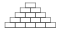

# Challenge problem: Brick Pyramid

Start with the "Yellow Brick Road" project from Unit 2.2 and adapt it to draw a pyramid of bricks.  Write code to prompt the user for the number of rows, then draw a pyramid of bricks (same size as in Lab 2.2) of the correct size. For example, if the user types in "5", create this picture:

If the user types in a nonsense response for the number of rows (ex: "cat"), have your program issue a warning and refuse to draw the picture.

Hints:

- use a variable to hold the requested number of rows

- search for a block that you can use to detect whether a value is numeric

