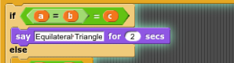
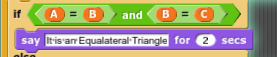

# Notes from Lab 2.5

As part of Lab 2.5 (triangle classification), one part of the lab asked you to check for an equilateral triangle. A few labs had code like this:

While this looks kind of like what you need (a = b = c), it is not correct: the "A = B" block is going to return a Boolean value (true or false), then the enclosing equality block will test that boolean value against "C", which will never be true: "c" contains a numeric value (4, 9, etc) while the "A = B" block is a true/false value.

Instead what's needed here is an AND block:

